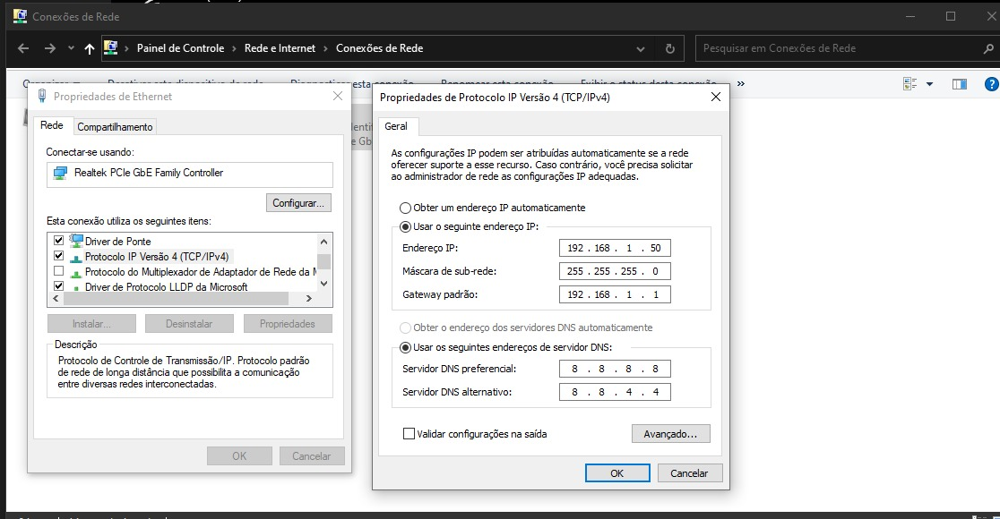

# LIDAR-Truckload-Volume-Calculator

This is a monorepo for the collaborative project (between UFSC and Coontrol) to calculate the volume of truck loads using Pepperl-Fuchs LiDAR sensors in a proper arrangement.

# Project structure

The project's root folder has a Python library `sensor_library.py` which encapsulates most of the useful HTTP requests we send to the sensors to either configure them or start scanning and outputting data.

The `receiver.py` is the actual main file that when run, triggers the required requests to the sensors, and handles data reception using an UDP server. The default configuration for the server address is the IP `192.168.1.50` with PORT `54321`.

For everything to work, the computer must be plugged into the switch (which is also plugged into all sensors), and you must also configure the local network connection to set the appropriate IP address. If using `192.168.1.50`, you need to set that into the local connection to the switch and sensors like in the image, so the network adapter in each sensor knows what or where is this IP address to send the UDP packets to.

# Useful links
[Pepperl-Fuchs R2000 HD Series LiDAR Ethernet Communication Documentation](https://files.pepperl-fuchs.com/webcat/navi/productInfo/doct/doct3469f.pdf?v=20201005101009)

[Pepperl-Fuchs R2000 HD Series LiDAR Technical Specifications Page](https://www.pepperl-fuchs.com/global/en/classid_53.htm?view=productdetails&prodid=86557#overview)

[Pepperl-Fuchs R2000 HD Series LiDAR Engineering Documentation](https://files.pepperl-fuchs.com/webcat/navi/productInfo/pds/305986_eng.pdf?v=20230509161542)

